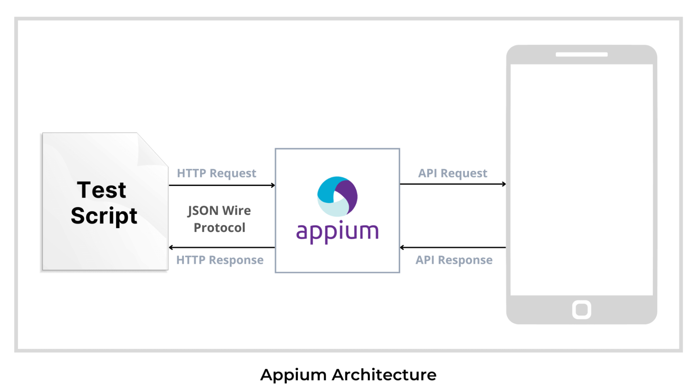
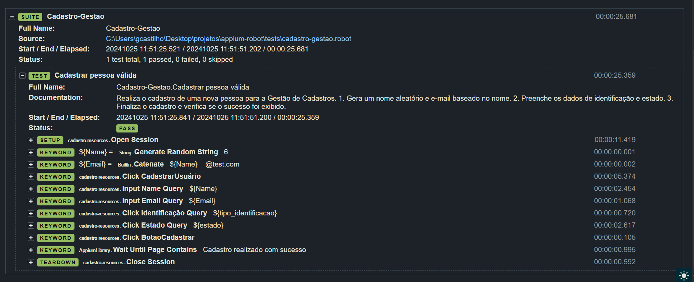

# Automação de Testes para Android com Robot Framework e Appium

Este projeto executa a automação do aplicativo Android [Appium](https://github.com/clarabez/appium-curso-apk) 
usando o [Robot Framework](https://robotframework.org/robotframework/) e a biblioteca 
[AppiumLibrary](https://github.com/serhatbolsu/robotframework-appiumlibrary). 
O objetivo é criar fluxos de teste de ponta a ponta para ações comuns de automação em aplicativos Android.

## Modelagem e Arquitetura:




## Sobre o Aplicativo em Teste

O aplicativo [Appium](https://github.com/clarabez/appium-curso-apk) é desenvolvido para automação mobile, 
focado no Appium. Ele é simples, projetado para simular fluxos de cadastro, e inclui elementos comuns em automação mobile, 
como campos de texto (EditText), menus de rolagem (spinner) e mensagens de notificação (toast messages).

## Organização do Projeto

```
appium-robot/
  ├── apks/                 # Aplicativos Android em teste
  ├── resources/            # Abstrações das telas e recursos para testes
  ├── tests/                # Scripts de teste para cada fluxo da aplicação
  ├── .gitignore            # Arquivo para ignorar arquivos no git
  └── requirements.txt      # Arquivo com dependências do projeto
```

## Pré-requisitos

1. **Python 3.9+** - Certifique-se de que o Python está instalado ([Guia de instalação](https://www.python.org/downloads/)).
2. **Appium Server** - Baixe e configure o Appium ([Guia de instalação](http://appium.io/docs/en/about-appium/intro/)).
3. **Java JDK** - Para rodar emuladores Android ([Guia de instalação](https://www.oracle.com/java/technologies/javase-downloads.html)).

Recomendamos o uso de um ambiente virtual (`virtualenv`) para isolar as dependências.

## Configuração do Ambiente

Clone o repositório:

```bash
git clone https://github.com/{USER}/mobile-appium-testing
cd appium-robot
```

### Instalando Dependências

Instale as dependências com:

```bash
pip install -r requirements.txt
```

Ou instale manualmente:

```bash
pip install robotframework-appiumlibrary
pip install appium-python-client
```

## Executando o Projeto

Inicie o servidor Appium e, em seguida, execute os testes com:

```bash
robot tests/cadastro-gestao.robot
```

### Recursos Úteis

- [Documentação Robot Framework](https://robotframework.org/robotframework/)
- [Documentação AppiumLibrary](http://serhatbolsu.github.io/robotframework-appiumlibrary/AppiumLibrary.html)

---

### Evidências Adicionais:



Este README foi feito para simplificar o uso do projeto e garantir uma configuração intuitiva.
